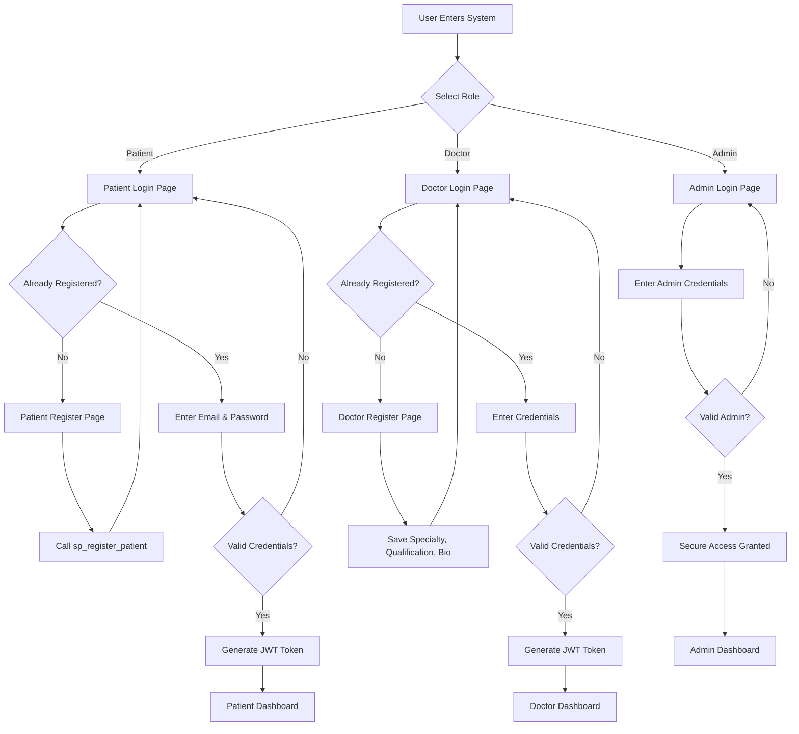
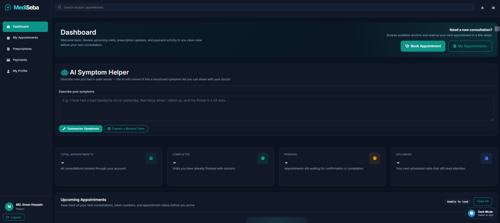
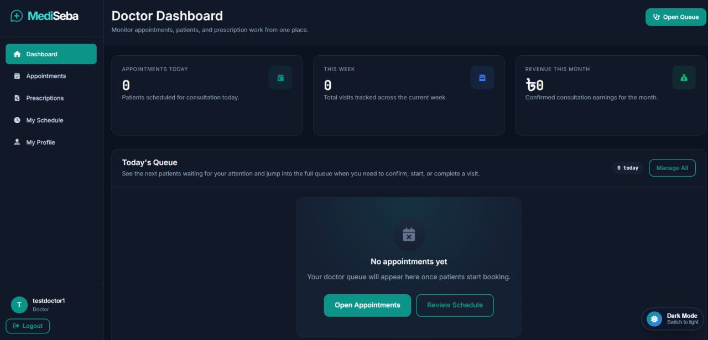
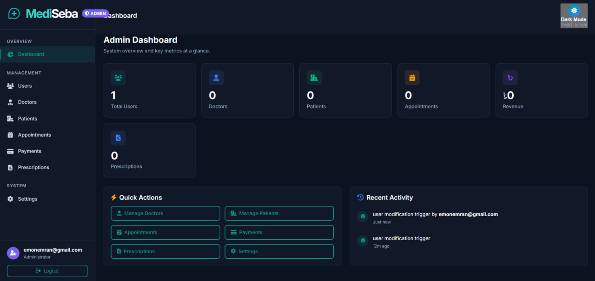
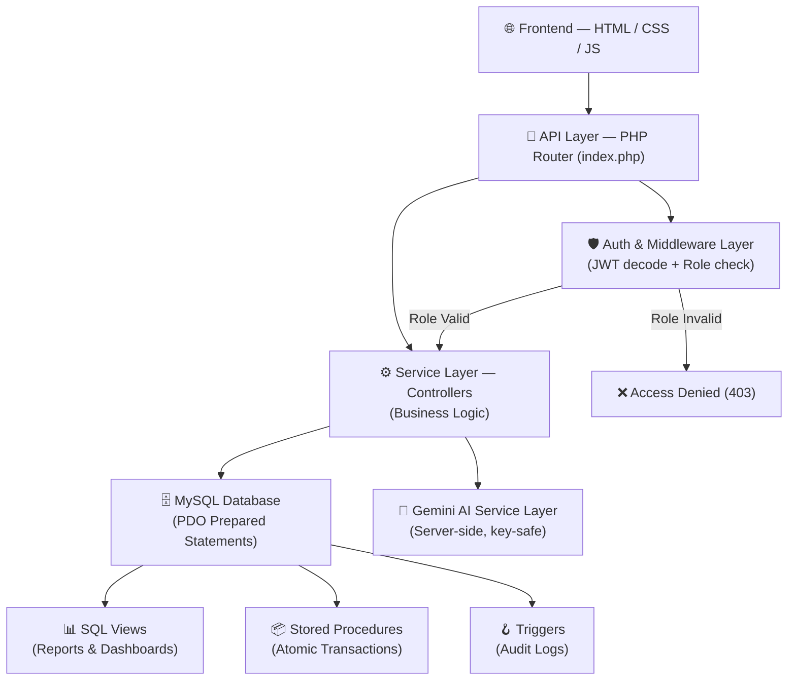
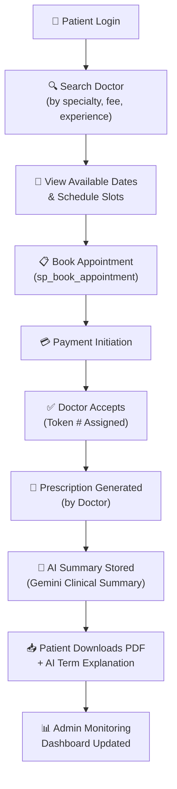
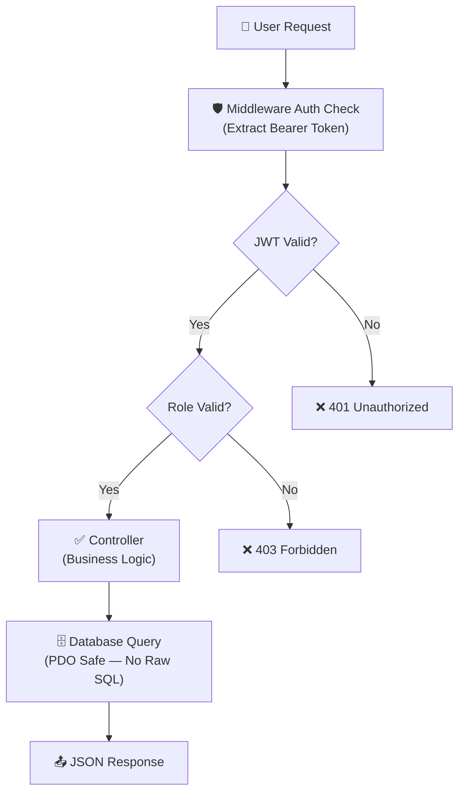
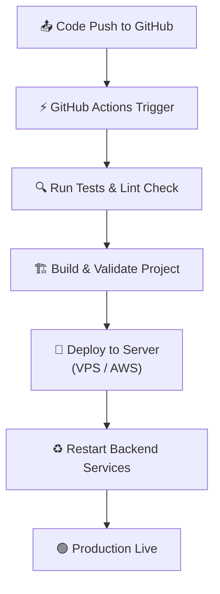
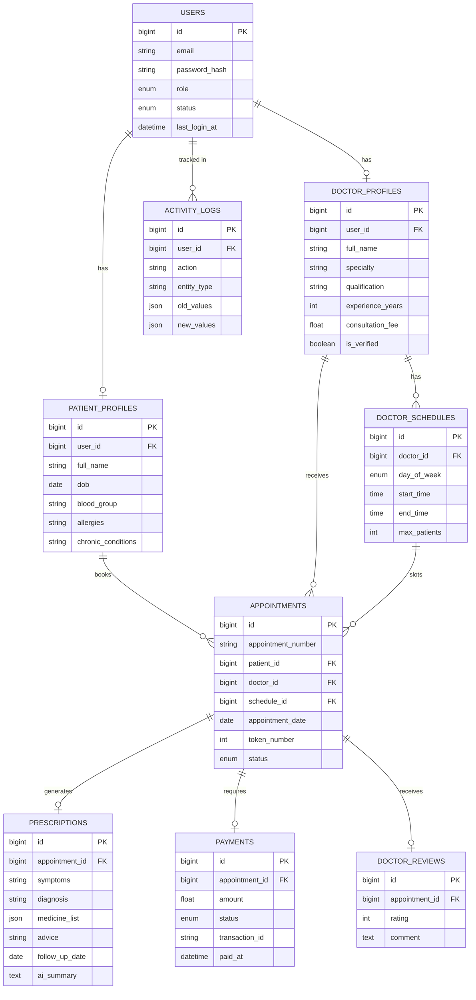

<div align="center">


# MediSeba

### 🏥 Intelligent Healthcare Appointment & Prescription Platform

[](https://php.net)
[](https://mysql.com)
[](https://developer.mozilla.org/en-US/docs/Web/JavaScript)
[](https://developer.mozilla.org/en-US/docs/Web/HTML)
[](https://deepmind.google/technologies/gemini/)
[](https://jwt.io)
[](LICENSE)
[](https://github.com/mohammademon10/MEDISEBA/pulls)

[](https://github.com/mohammademon10/MEDISEBA/stargazers)
[](https://github.com/mohammademon10/MEDISEBA/network)
[](https://github.com/mohammademon10/MEDISEBA/issues)

**MediSeba** is a full-stack, multi-role healthcare management platform built for Bangladesh's digital health ecosystem. It connects patients with verified doctors, automates appointment workflows, generates digital prescriptions with PDF export, processes payments, and leverages **Google Gemini 1.5 Pro AI** to summarize symptoms and produce clinical-grade diagnostic summaries — all secured by JWT authentication and a hardened PHP backend.

[🔗 View Repository](https://github.com/mohammademon10/MEDISEBA) · [📋 Report Bug](https://github.com/mohammademon10/MEDISEBA/issues) · [✨ Request Feature](https://github.com/mohammademon10/MEDISEBA/issues)

</div>

---

## 📸 Screenshots

<details>
<summary><b>🏠 Landing Page & Public Interface</b></summary>
<br/>

| Page | Description |
|------|-------------|
| `index.html` | Hero section with live patient count badge, featured doctors carousel, specialties grid, and how-it-works steps |
| `pages/doctors.html` | Searchable, filterable doctor directory with specialty, experience, and fee filters |
| `pages/about.html` | Platform mission, team, and technology overview |
| `pages/how-it-works.html` | Illustrated 4-step patient journey explanation |

</details>

<details>
<summary><b>🔐 Authentication Flows</b></summary>
<br/>
  


| Page | Role | Description |
|------|------|-------------|
| `auth/login.html` | Patient | Email/password login with JWT token persistence |
| `auth/register.html` | Patient | Multi-step registration invoking `sp_register_patient` stored procedure |
| `auth/doctor-login.html` | Doctor | Doctor-specific login portal |
| `auth/doctor-register.html` | Doctor | Doctor registration with specialty, qualification, and bio fields |
| `auth/admin-login.html` | Admin | Secure admin login with separate credential validation |

</details>

<details>
<summary><b>🧑‍⚕️ Patient Dashboard</b></summary>
<br/>
<p align="center">
  
</p>
  
| Page | Description |
|------|-------------|
| `patient/dashboard.html` | Welcome panel, upcoming appointments, quick stats, AI symptom input widget |
| `patient/appointment.html` | Step-by-step appointment booking: choose doctor → pick schedule → select date → confirm |
| `patient/appointments.html` | Full appointment history with status badges (pending/confirmed/completed/cancelled) |
| `patient/prescriptions.html` | All prescriptions with search and AI explanation panel |
| `patient/prescription.html` | Single prescription detail with Gemini-powered medical term explainer and PDF download |
| `patient/payments.html` | Payment history with receipt download |
| `patient/profile.html` | Profile editor with photo upload, health info (blood group, allergies, chronic conditions) |

</details>

<details>
<summary><b>👨‍⚕️ Doctor Portal</b></summary>
<br/>
<p align="center">
  
</p>
  
| Page | Description |
|------|-------------|
| `doctor/doctor-dashboard.html` | Today's queue, earnings summary, patient count, rating overview |
| `doctor/doctor-appointments.html` | Appointment queue with accept/complete/cancel actions |
| `doctor/doctor-prescriptions.html` | All issued prescriptions with edit and delete capabilities |
| `doctor/doctor-schedule.html` | Weekly schedule manager (day, start/end time, max patients per slot) |
| `doctor/doctor-my-profile.html` | Doctor profile editor: bio, fee, clinic, qualification, profile photo |
| `doctor/doctor-profile.html` | Public-facing doctor profile view |

</details>

<details>
<summary><b>🛡️ Admin Control Panel</b></summary>
<br/>
<p align="center">
  
</p>

| Page | Description |
|------|-------------|
| `admin/admin-dashboard.html` | Platform KPIs: total users, revenue, appointments, active doctors |
| `admin/admin-users.html` | All users list with status toggle (active/suspended) and delete |
| `admin/admin-doctors.html` | Doctor verification panel — approve or reject pending doctor registrations |
| `admin/admin-patients.html` | Patient management with status control |
| `admin/admin-appointments.html` | Global appointment registry with cancellation authority |
| `admin/admin-payments.html` | Full financial ledger with receipt access |
| `admin/admin-prescriptions.html` | System-wide prescription browser |
| `admin/admin-settings.html` | Platform configuration controls |

</details>

---

## 📌 Project Overview

MediSeba (মেডিসেবা, meaning "Medical Service" in Bengali) is a **DBMS-focused academic project** built to demonstrate enterprise-grade software engineering principles within a healthcare domain. The platform is designed around Bangladesh's healthcare access challenges — enabling patients in any location to discover verified doctors, book appointments with a token-based queue system, and receive structured digital prescriptions.

### What makes MediSeba stand out

- **AI-Augmented Prescriptions** — Google Gemini 1.5 Pro explains medical terms in plain language for patients and generates clinical diagnostic summaries for doctors, server-side, keeping the API key fully protected
- **Advanced Database Architecture** — MySQL with stored procedures (`sp_register_patient`, `sp_book_appointment`), triggers for full audit logging (`trg_appointment_status_audit`, `trg_user_status_audit`), and 3 analytical SQL views for dashboards
- **Token-Based Queue System** — Appointments generate sequential token numbers per doctor per day, giving patients a clear waiting position
- **Zero-Dependency PDF Engine** — A custom pure-PHP PDF builder (`SimplePdfDocument`) generates prescription and payment receipt PDFs without requiring any third-party library
- **Hardened Security Stack** — Argon2ID password hashing, HMAC-SHA256 JWT with configurable expiry, CSRF token lifecycle management, PDO prepared statements across all queries, rate limiting per IP/action type, and strict Apache security headers

---

## ✨ Features

### 🔐 Authentication & Access Control
- JWT Bearer token authentication with configurable expiry (default: 24h)
- Role-Based Access Control: `patient`, `doctor`, `admin` roles enforced at middleware layer
- Optional auth for public endpoints (doctor search, featured listings)
- Secure session initialization with `Security::initSecureSession()`
- Multiple Authorization header fallback strategies for shared hosting compatibility

### 🧑‍⚕️ Patient Features
- Browse and filter doctors by name, specialty, experience, and consultation fee
- View real-time doctor availability by day and date
- Book appointments with token number assignment via `sp_book_appointment` stored procedure
- View appointment history with status tracking
- Read prescriptions with AI-powered term explanations (Gemini)
- Summarize symptoms conversationally before a visit
- Download prescription and payment receipt PDFs
- Manage health profile: blood group, allergies, chronic conditions, emergency contact
- Upload profile photo with MIME-type validation

### 👨‍⚕️ Doctor Features
- Manage weekly schedule (day-of-week, time slots, max patients per slot)
- View today's appointment queue and upcoming appointments
- Accept, complete, or cancel appointments
- Create structured digital prescriptions with medicine list, dosage, diagnosis, and follow-up date
- Edit and delete issued prescriptions
- Generate clinical AI summaries via Gemini for complex cases
- View earnings summary and patient statistics
- Manage public profile and clinic information

### 🛡️ Admin Features
- Monitor platform KPIs via aggregated dashboard
- Verify or reject doctor registration applications
- Manage all users, patients, and doctors (status toggle, delete)
- Access full appointment, payment, and prescription history system-wide
- Download payment receipts
- Configure system settings

### 🤖 AI Integration (Google Gemini 1.5 Pro)
- `POST /api/gemini/explain` — Explains medical terms or diagnoses in patient-friendly language
- `POST /api/gemini/summarize-symptoms` — Converts conversational patient description into a structured clinical symptom list
- `POST /api/gemini/clinical-summary` — Generates professional diagnostic-style case summaries for doctors
- All Gemini calls are **server-side only** — API key never exposed to the frontend

### 💳 Payment System
- Payment initiation linked to appointments
- Webhook callback endpoint for payment gateway integration
- Doctor-initiated refund support
- Downloadable payment receipt PDFs
- Financial reporting via `vw_financial_reports` SQL view

---

## 🛠️ Tech Stack

| Layer | Technology | Purpose |
|-------|-----------|---------|
| **Frontend** | HTML5, CSS3, Vanilla JS (ES2022) | Multi-page application UI |
| **Fonts & Icons** | Google Fonts (Inter), Font Awesome 6.4 | Typography and iconography |
| **Backend** | PHP 8.1+ (no framework) | RESTful API, business logic |
| **Database** | MySQL / MariaDB 10.4+ | Persistent data store |
| **ORM Layer** | Custom PDO Model base class | Secure, typed query abstraction |
| **Authentication** | JWT (HMAC-SHA256) | Stateless Bearer token auth |
| **Password Hashing** | Argon2ID | Industry-leading password security |
| **AI Engine** | Google Gemini 1.5 Pro REST API | Symptom parsing, term explanation, clinical summaries |
| **PDF Generation** | Custom PHP PDF Builder (no libs) | Prescriptions and receipts |
| **Web Server** | Apache (XAMPP/LAMP/VPS) | Hosting with `.htaccess` rewrite rules |
| **Rate Limiting** | MySQL-backed rate limiter | Prevent login/API abuse |
| **Environment** | `.env` file via custom loader | 12-factor app config |
| **CI/CD Pipeline** | GitHub Actions | Lint, test, build, deploy |

---

## 📂 Project Structure

```
MEDISEBA/
│
├── 📄 index.html                   # Landing page (public)
├── 📄 .htaccess                    # Apache root rules: block .env, .sql, dotfiles
├── 📄 .env                         # Environment config (gitignored)
│
├── 📁 auth/                        # Authentication pages
│   ├── login.html                  # Patient login
│   ├── register.html               # Patient registration
│   ├── doctor-login.html           # Doctor login
│   ├── doctor-register.html        # Doctor self-registration
│   └── admin-login.html            # Admin login
│
├── 📁 patient/                     # Patient portal
│   ├── dashboard.html              # Patient home + AI symptom widget
│   ├── appointment.html            # Appointment booking wizard
│   ├── appointments.html           # Appointment history
│   ├── prescription.html           # Single prescription + AI explainer
│   ├── prescriptions.html          # All prescriptions
│   ├── payments.html               # Payment history
│   └── profile.html                # Patient profile editor
│
├── 📁 doctor/                      # Doctor portal
│   ├── doctor-dashboard.html       # Doctor home + stats
│   ├── doctor-appointments.html    # Queue management
│   ├── doctor-prescriptions.html   # Issued prescriptions
│   ├── doctor-schedule.html        # Weekly schedule manager
│   ├── doctor-my-profile.html      # Edit own profile
│   └── doctor-profile.html         # Public profile view
│
├── 📁 admin/                       # Admin control panel
│   ├── admin-dashboard.html        # Platform KPIs
│   ├── admin-users.html            # User management
│   ├── admin-doctors.html          # Doctor verification
│   ├── admin-patients.html         # Patient management
│   ├── admin-appointments.html     # All appointments
│   ├── admin-payments.html         # Financial ledger
│   ├── admin-prescriptions.html    # Prescription browser
│   └── admin-settings.html         # System configuration
│
├── 📁 pages/                       # Public static pages
│   ├── doctors.html                # Doctor directory
│   ├── about.html                  # About MediSeba
│   ├── how-it-works.html           # Patient journey guide
│   ├── privacy.html                # Privacy policy
│   └── terms.html                  # Terms of service
│
├── 📁 js/                          # Frontend JavaScript modules
│   ├── api.js                      # API client with dynamic base URL resolution
│   ├── auth.js                     # JWT token & user state management
│   ├── app.js                      # Shared UI components and page logic (1182 lines)
│   └── admin-api.js                # Admin-specific API calls
│
├── 📁 css/                         # Stylesheets
│   ├── style.css                   # Main styles (1989 lines) — light/dark theme
│   ├── admin.css                   # Admin panel styles (1025 lines)
│   ├── auth.css                    # Authentication pages (4362 lines)
│   ├── responsive.css              # Mobile/tablet breakpoints
│   └── chat.css                    # (Legacy — chat module deprecated)
│
├── 📁 images/                      # Static assets
│   ├── logo.jpg / logo-mark.svg    # Brand assets
│   ├── hero-brand.png              # Hero section illustration
│   ├── hero-doctor.svg             # Doctor illustration
│   ├── default-doctor.svg          # Fallback doctor avatar
│   └── Background-photos/          # Page background images
│
├── 📁 backend/                     # PHP API backend
│   ├── index.php                   # Router & entry point (all routes defined here)
│   ├── .htaccess                   # Rewrite to index.php + security headers
│   │
│   ├── 📁 config/
│   │   ├── database.php            # PDO singleton connection with pooling
│   │   └── environment.php         # .env loader & env accessor
│   │
│   ├── 📁 middleware/
│   │   └── AuthMiddleware.php      # JWT decode → role check → user injection
│   │
│   ├── 📁 controllers/
│   │   ├── AuthController.php      # Register, login, logout, me, refresh, profile
│   │   ├── DoctorController.php    # Doctor search, profiles, schedules, availability
│   │   ├── AppointmentController.php  # Book, list, status update, cancel, review
│   │   ├── PrescriptionController.php # Create, list, PDF download, edit, delete
│   │   ├── PaymentController.php   # Initiate, callback, refund, receipt PDF
│   │   ├── GeminiController.php    # AI: explain term, summarize symptoms, clinical summary
│   │   ├── UploadController.php    # Profile photo upload with MIME validation
│   │   └── ConfigController.php    # Public platform config endpoint
│   │   └── 📁 admin/
│   │       ├── AdminDashboardController.php   # Stats and recent activity
│   │       ├── AdminUserController.php        # User CRUD + status
│   │       ├── AdminDoctorController.php      # Verify/update doctors
│   │       ├── AdminPatientController.php     # Patient status management
│   │       ├── AdminAppointmentController.php # Cancel appointments
│   │       ├── AdminPaymentController.php     # Financial overview + receipts
│   │       ├── AdminPrescriptionController.php # System prescription browser
│   │       └── AdminSettingsController.php    # System settings CRUD
│   │
│   ├── 📁 models/
│   │   ├── Model.php               # Base PDO model (find, create, update, delete, paginate)
│   │   ├── User.php                # User entity with email lookup
│   │   ├── DoctorProfile.php       # Doctor search, slug, schedule, availability
│   │   ├── PatientProfile.php      # Patient profile with health info
│   │   ├── Appointment.php         # Appointment CRUD + token numbering
│   │   ├── Prescription.php        # Prescription with medicine JSON
│   │   ├── Payment.php             # Payment records + financial reporting
│   │   ├── DoctorReview.php        # Star ratings and review text
│   │   └── AppointmentChatMessage.php  # (Legacy — deprecated)
│   │
│   └── 📁 utils/
│       ├── Security.php            # JWT sign/verify, Argon2ID hash, CSRF, OTP
│       ├── Validator.php           # Pipe-syntax field validator (required, email, min, max, date, future, array...)
│       ├── Response.php            # Standardized JSON response helpers
│       ├── RateLimiter.php         # MySQL-backed rate limiting (login, OTP, API)
│       ├── GeminiService.php       # Gemini REST client (server-side, key-safe)
│       └── SimplePdfDocument.php  # Zero-dependency PDF generator (A4, Type1 fonts)
│
├── 📁 database/
│   └── mediseba_local.sql          # Full MySQL dump: tables, data, procedures, triggers, views
│
└── 📁 A_Project_Documents/
    ├── DBMS_project_proposal.pdf   # Academic project proposal
    └── MediSeba – ... pre.pptx    # Presentation slides
```

---

## 🏗️ Architecture

### System Architecture



### Patient Appointment Flow



### Security Flow



### CI/CD Pipeline



### Database Entity Relationship



---

## ▶️ Installation Guide

### Prerequisites

| Requirement | Minimum Version |
|-------------|----------------|
| PHP | 8.1+ |
| MySQL / MariaDB | 8.0+ / 10.4+ |
| Apache | 2.4+ with `mod_rewrite` enabled |
| Web Server Stack | XAMPP, WAMP, LAMP, or VPS |

### Step 1 — Clone the Repository

```bash
git clone https://github.com/mohammademon10/MEDISEBA.git
cd MEDISEBA
```

### Step 2 — Configure Environment

Copy the example environment file and edit it:

```bash
cp .env.example .env   # or manually create .env from the template below
```

Edit `.env` with your configuration:

```env
# Application
APP_NAME=MediSeba
APP_ENV=local
APP_DEBUG=true
APP_URL=http://localhost/MEDISEBA
APP_TIMEZONE=Asia/Dhaka

# Database
DB_HOST=localhost
DB_PORT=3306
DB_DATABASE=mediseba_local
DB_USERNAME=root
DB_PASSWORD=

# Security — Generate your own JWT secret (min 32 chars)
JWT_SECRET=your-super-secret-jwt-key-minimum-32-characters-long
JWT_EXPIRY=86400

# Rate Limiting
RATE_LIMIT_ENABLED=true
RATE_LIMIT_LOGIN=5
RATE_LIMIT_API=100

# CORS
CORS_ALLOWED_ORIGINS=http://localhost,http://127.0.0.1

# Payment Gateway
PAYMENT_GATEWAY_SECRET=your-payment-gateway-secret

# Google Gemini AI (get key from https://aistudio.google.com)
GEMINI_API_KEY=your_gemini_api_key_here
GEMINI_MODEL_VERSION=gemini-1.5-pro
```

### Step 3 — Import the Database

```bash
# Using MySQL CLI
mysql -u root -p < database/mediseba_local.sql

# Or using phpMyAdmin:
# 1. Create a database named: mediseba_local
# 2. Import: database/mediseba_local.sql
```

This creates all 14 tables, 3 SQL views, 2 stored procedures, and 2 audit triggers.

### Step 4 — Configure Web Server

**For XAMPP / WAMP:** Place the project folder inside `htdocs/` or `www/`. Ensure `mod_rewrite` is enabled in `httpd.conf`:

```apache
LoadModule rewrite_module modules/mod_rewrite.so
```

Also set `AllowOverride All` for your project directory:

```apache
<Directory "C:/xampp/htdocs/MEDISEBA">
    AllowOverride All
</Directory>
```

**For Apache on Linux VPS:**

```bash
sudo a2enmod rewrite
sudo systemctl restart apache2
```

### Step 5 — Access the Application

| Portal | URL |
|--------|-----|
| Landing Page | `http://localhost/MEDISEBA/` |
| Patient Login | `http://localhost/MEDISEBA/auth/login.html` |
| Doctor Login | `http://localhost/MEDISEBA/auth/doctor-login.html` |
| Admin Login | `http://localhost/MEDISEBA/auth/admin-login.html` |
| API Base | `http://localhost/MEDISEBA/backend/index.php` |

### Default Test Credentials

The provided SQL dump includes seeded test users. Check `database/mediseba_local.sql` for pre-seeded accounts, or register new ones via the registration pages.

> **Admin accounts** must be created via `POST /api/auth/register-admin` with appropriate credentials, or by manually updating a user's role to `admin` in the database.

---

## 🔌 API Documentation

All API responses follow a consistent JSON envelope:

```json
{
  "success": true,
  "message": "Operation description",
  "data": { ... },
  "timestamp": "2026-04-17T10:00:00+06:00"
}
```

### Authentication

| Method | Endpoint | Auth | Description |
|--------|----------|------|-------------|
| `POST` | `/api/auth/register` | Public | Register patient or doctor |
| `POST` | `/api/auth/login` | Public | Login, receive JWT |
| `GET` | `/api/auth/me` | 🔐 Auth | Get current user profile |
| `POST` | `/api/auth/logout` | 🔐 Auth | Invalidate session |
| `POST` | `/api/auth/refresh` | 🔐 Auth | Refresh JWT token |
| `POST` | `/api/auth/complete-profile` | 🔐 Auth | Complete post-registration profile |
| `PUT` | `/api/auth/profile` | 🔐 Patient | Update patient profile |

**Login Request:**
```json
POST /api/auth/login
{
  "email": "patient@example.com",
  "password": "securepassword"
}
```

**Login Response:**
```json
{
  "success": true,
  "message": "Login successful",
  "data": {
    "token": "eyJhbGciOiJIUzI1NiIsInR5cCI6IkpXVCJ9...",
    "user": {
      "id": 1,
      "email": "patient@example.com",
      "role": "patient"
    }
  }
}
```

### Doctors

| Method | Endpoint | Auth | Description |
|--------|----------|------|-------------|
| `GET` | `/api/doctors` | Public | List/search doctors (filters: name, specialty, min_experience, max_fee) |
| `GET` | `/api/doctors/featured` | Public | Get featured doctors |
| `GET` | `/api/doctors/specialties` | Public | Get all available specialties |
| `GET` | `/api/doctors/public-stats` | Public | Platform statistics (patient count, doctor count) |
| `GET` | `/api/doctors/{id}` | Public | Get single doctor profile |
| `GET` | `/api/doctors/{id}/schedule` | Public | Get doctor's weekly schedule |
| `GET` | `/api/doctors/{id}/available-dates` | Public | Get available booking dates |
| `GET` | `/api/doctors/profile` | 🔐 Doctor | Get own profile |
| `PUT` | `/api/doctors/profile` | 🔐 Doctor | Update own profile |
| `PUT` | `/api/doctors/schedule` | 🔐 Doctor | Update weekly schedule |

**Doctor Search Example:**
```
GET /api/doctors?specialty=Cardiology&max_fee=500&sort=experience_years&order=DESC&page=1&per_page=10
```

### Appointments

| Method | Endpoint | Auth | Description |
|--------|----------|------|-------------|
| `POST` | `/api/appointments` | 🔐 Patient | Book appointment (calls `sp_book_appointment`) |
| `GET` | `/api/appointments/my-appointments` | 🔐 Patient | Patient's appointment history |
| `GET` | `/api/appointments/upcoming` | 🔐 Patient | Upcoming appointments |
| `GET` | `/api/appointments/doctor-appointments` | 🔐 Doctor | Doctor's appointment queue |
| `GET` | `/api/appointments/today` | 🔐 Doctor | Today's patient queue |
| `GET` | `/api/appointments/{id}` | 🔐 Auth | Get single appointment |
| `PATCH` | `/api/appointments/{id}/status` | 🔐 Auth | Update status (confirmed/completed/cancelled) |
| `POST` | `/api/appointments/{id}/cancel` | 🔐 Auth | Cancel appointment |
| `POST` | `/api/appointments/{id}/review` | 🔐 Patient | Submit star rating and review |

**Book Appointment Request:**
```json
POST /api/appointments
Authorization: Bearer <token>
{
  "doctor_id": 3,
  "schedule_id": 7,
  "appointment_date": "2026-04-25",
  "symptoms": "Persistent headache and fatigue for 3 days",
  "notes": "First visit"
}
```

### Prescriptions

| Method | Endpoint | Auth | Description |
|--------|----------|------|-------------|
| `POST` | `/api/prescriptions` | 🔐 Doctor | Create prescription |
| `GET` | `/api/prescriptions/my-prescriptions` | 🔐 Patient | Patient's prescriptions |
| `GET` | `/api/prescriptions/doctor-prescriptions` | 🔐 Doctor | Doctor's issued prescriptions |
| `GET` | `/api/prescriptions/{id}` | 🔐 Auth | Get single prescription |
| `GET` | `/api/prescriptions/{id}/pdf` | 🔐 Auth | Download prescription as PDF |
| `PUT` | `/api/prescriptions/{id}` | 🔐 Doctor | Update prescription |
| `DELETE` | `/api/prescriptions/{id}` | 🔐 Doctor | Delete prescription |

### Payments

| Method | Endpoint | Auth | Description |
|--------|----------|------|-------------|
| `POST` | `/api/payments/initiate` | 🔐 Patient | Initiate payment for appointment |
| `POST` | `/api/payments/callback` | Public | Payment gateway webhook callback |
| `GET` | `/api/payments/my-payments` | 🔐 Patient | Patient's payment history |
| `GET` | `/api/payments/doctor-payments` | 🔐 Doctor | Doctor's earnings |
| `GET` | `/api/payments/{id}` | 🔐 Auth | Get payment details |
| `GET` | `/api/payments/{id}/receipt` | 🔐 Auth | Download receipt PDF |
| `POST` | `/api/payments/{id}/refund` | 🔐 Doctor | Issue refund |

### AI (Gemini)

| Method | Endpoint | Auth | Description |
|--------|----------|------|-------------|
| `POST` | `/api/gemini/explain` | 🔐 Patient | Explain a medical term in plain language |
| `POST` | `/api/gemini/summarize-symptoms` | 🔐 Patient | Convert symptom description to clinical bullet list |
| `POST` | `/api/gemini/clinical-summary` | 🔐 Doctor | Generate diagnostic-style case summary |

**AI Explain Request:**
```json
POST /api/gemini/explain
Authorization: Bearer <token>
{
  "term": "Myocardial infarction"
}
```

### Admin

| Method | Endpoint | Auth | Description |
|--------|----------|------|-------------|
| `GET` | `/api/admin/dashboard/stats` | 🔐 Admin | Platform KPIs |
| `GET` | `/api/admin/dashboard/activity` | 🔐 Admin | Recent activity log |
| `GET` | `/api/admin/users` | 🔐 Admin | All users |
| `PATCH` | `/api/admin/users/{id}/status` | 🔐 Admin | Toggle user status |
| `DELETE` | `/api/admin/users/{id}` | 🔐 Admin | Delete user |
| `GET` | `/api/admin/doctors` | 🔐 Admin | All doctors |
| `PATCH` | `/api/admin/doctors/{id}/verify` | 🔐 Admin | Verify / reject doctor |
| `GET` | `/api/admin/appointments` | 🔐 Admin | All appointments |
| `GET` | `/api/admin/payments` | 🔐 Admin | All payments |
| `GET` | `/api/admin/prescriptions` | 🔐 Admin | All prescriptions |

### File Uploads

| Method | Endpoint | Auth | Description |
|--------|----------|------|-------------|
| `POST` | `/api/uploads/profile-photo` | 🔐 Auth | Upload profile photo (multipart/form-data, max 5MB, JPG/PNG) |

---

## 🔐 Security Features

MediSeba implements a comprehensive, defense-in-depth security strategy:

### Authentication & Authorization
- **JWT (HMAC-SHA256)** with configurable secret and expiry — minimum key length enforced (32+ chars)
- **Argon2ID** password hashing with tuned memory cost (64MB), time cost (4 iterations), and parallelism — the strongest available PHP password algorithm
- **Role-Based Access Control** enforced at the middleware layer before any controller logic executes
- Multiple `Authorization` header fallback strategies to prevent token loss on shared hosting

### Input Security
- All database queries use **PDO prepared statements** — SQL injection is structurally impossible
- Custom `Validator` class with typed rules: `required`, `email`, `min/max`, `integer`, `date`, `future`, `array` — applied on every endpoint
- `htmlspecialchars()` applied to all AI prompt inputs before sending to Gemini
- File upload validation: extension whitelist, MIME-type detection via `finfo`, `getimagesize()` integrity check, randomized filenames

### Rate Limiting
- MySQL-backed rate limiter (`rate_limits` table) tracks attempts per IP and action type
- Configurable limits via `.env`: `RATE_LIMIT_LOGIN=5`, `RATE_LIMIT_API=100`
- Automatic cleanup of expired rate limit windows

### HTTP Security Headers (Apache + PHP)
```
X-Frame-Options: DENY
X-Content-Type-Options: nosniff
X-XSS-Protection: 1; mode=block
Referrer-Policy: strict-origin-when-cross-origin
Permissions-Policy: geolocation=(), microphone=(), camera=()
Content-Security-Policy: default-src 'self'; script-src 'self' 'unsafe-inline' cdn.jsdelivr.net; ...
```

### Infrastructure Security
- `.htaccess` blocks direct access to `.env`, `.sql`, `.log`, `.ini`, `.sh` files
- Directory browsing disabled (`Options -Indexes`)
- CORS origin whitelist enforced — only configured domains receive credentials
- `gzip` compression and asset caching via `mod_deflate` and `mod_expires`
- CSRF token lifecycle management via `Security::generateCSRFToken()` and `verifyCSRFToken()`

### Database Security
- **Stored Procedure** `sp_register_patient` performs atomic user+profile creation — no partial state possible
- **Stored Procedure** `sp_book_appointment` atomically validates schedule availability and assigns token numbers
- **Trigger** `trg_appointment_status_audit` records every appointment status change with old/new values, user ID, and IP
- **Trigger** `trg_user_status_audit` logs every user role or status modification for admin accountability
- **Audit log** persists to `activity_logs` table with JSON diff of changed fields

---

## 🗄️ Database Design

MediSeba's database consists of 14 tables, engineered with normalization, referential integrity, and performance indexing:

### Core Tables

| Table | Rows (Seed) | Purpose |
|-------|-------------|---------|
| `users` | — | Auth entity: email, password hash, role, status |
| `doctor_profiles` | — | Doctor attributes: specialty, qualification, fee, bio, clinic |
| `patient_profiles` | — | Patient health info: DOB, blood group, allergies, emergency contact |
| `doctor_schedules` | — | Weekly availability slots per doctor |
| `doctor_timeoffs` | — | Blocked dates per doctor |
| `appointments` | — | Core booking record with token number assignment |
| `appointment_status_history` | — | Full state machine log for each appointment |
| `prescriptions` | — | Doctor-issued prescriptions with JSON medicine list |
| `prescription_attachments` | — | File attachments to prescriptions |
| `payments` | — | Payment records linked to appointments |
| `doctor_reviews` | — | Star ratings and review text per appointment |
| `notifications` | — | In-app notification store |
| `activity_logs` | 1 (seed) | Audit trail for all system modifications |
| `rate_limits` | — | Per-IP/action rate limiting state |
| `otp_requests` | — | OTP generation and verification records |
| `system_settings` | — | Key/value platform configuration |

### SQL Views

| View | Description |
|------|-------------|
| `vw_appointment_details` | Joins appointments with patient, doctor, schedule data — used in all dashboards |
| `vw_financial_reports` | Joins payments with appointment, doctor, patient — used in financial analytics |
| `vw_user_master_profile` | Unified user + profile view resolving patient vs doctor profile per user |

### Stored Procedures

| Procedure | Description |
|-----------|-------------|
| `sp_register_patient` | Atomically creates user + patient profile, returns `@out_id` |
| `sp_book_appointment` | Validates availability, assigns sequential token number, creates appointment |

---

## 🧪 Testing

### Manual Testing Checklist

**Authentication:**
- [ ] Patient registration creates user + patient profile via stored procedure
- [ ] Doctor registration creates user + doctor profile (auto-verified)
- [ ] Login returns valid JWT token
- [ ] Protected routes return 401 without token
- [ ] Role-restricted routes return 403 for wrong role
- [ ] Rate limiter blocks after 5 failed logins

**Patient Flows:**
- [ ] Doctor search filters by specialty, fee, experience
- [ ] Available dates correctly exclude doctor timeoffs and full slots
- [ ] Appointment booking assigns sequential token number
- [ ] Appointment cancellation updates status and status history
- [ ] Prescription download generates valid PDF
- [ ] AI term explanation returns Gemini response
- [ ] Profile photo upload validates MIME type and file size

**Doctor Flows:**
- [ ] Today's queue shows correct appointments
- [ ] Status update (confirm / complete) persists to DB
- [ ] Prescription creation with medicine list saves as JSON
- [ ] Refund initiation updates payment record
- [ ] Schedule update reflects on patient booking page

**Admin Flows:**
- [ ] Dashboard stats aggregate correctly
- [ ] Doctor verification updates `is_verified` flag
- [ ] User status toggle suspends/reactivates account
- [ ] Activity log shows all modifications with IP and user

### API Testing with cURL

```bash
# Register a patient
curl -X POST http://localhost/MEDISEBA/backend/index.php/api/auth/register \
  -H "Content-Type: application/json" \
  -d '{"full_name":"Test Patient","email":"patient@test.com","password":"secret123","role":"patient"}'

# Login
curl -X POST http://localhost/MEDISEBA/backend/index.php/api/auth/login \
  -H "Content-Type: application/json" \
  -d '{"email":"patient@test.com","password":"secret123"}'

# Search doctors (public)
curl "http://localhost/MEDISEBA/backend/index.php/api/doctors?specialty=Cardiology&max_fee=1000"

# Book appointment (authenticated)
curl -X POST http://localhost/MEDISEBA/backend/index.php/api/appointments \
  -H "Content-Type: application/json" \
  -H "Authorization: Bearer YOUR_JWT_TOKEN" \
  -d '{"doctor_id":1,"schedule_id":2,"appointment_date":"2026-05-01","symptoms":"Fever and cough"}'
```

---

## 👥 Team

<div align="center">

| Avatar | Name | Role | Student ID | Responsibilities |
|--------|------|------|------------|-----------------|
| 👨‍💻 | **Md. Emon Hossain** | Team Leader | 232-15-818 | Backend Architecture, Frontend Development, Database Design, API Documentation |
| 👨‍💻 | **Mostafizur Rahman Antu** | Member | 241-15-631 | Backend Development, Frontend Development, Database Design |
| 👨‍💻 | **Nahid Al Galib** | Member | 241-15-577 | Testing & Data Entry |
| 👩‍💻 | **Mahjabin Sultana** | Member | 241-15-899 | Testing & Data Entry |
| 👩‍💻 | **Nadira Tanzim** | Member | 241-15-397 | Testing & Data Entry |

**Institution:** Daffodil International University
**Course:** Database Management Systems (DBMS)- CSE312 
**Supervisor:** Syed Eftasum Alam (Lecturer) , Department of Computer Science & Engineering

</div>

---

## 🔮 Future Improvements

The following enhancements are planned for future development iterations:

**Platform Features:**
- 📱 **Progressive Web App (PWA)** — Offline support and home screen installation
- 🔔 **Real-time Notifications** — WebSocket-based push notifications for appointment updates
- 💬 **Telemedicine Video** — WebRTC integration for virtual consultations
- 📧 **Email Notifications** — Appointment reminders and prescription delivery via SMTP
- 🌐 **Multi-language Support** — Full Bengali (বাংলা) localization
- 📊 **Analytics Dashboard** — Advanced charts with Chart.js for health trend tracking
- 🗓️ **Calendar Integration** — Google Calendar sync for appointments

**Technical Improvements:**
- 🐳 **Docker Containerization** — Docker Compose setup for reproducible deployment
- ✅ **PHPUnit Test Suite** — Automated unit and integration tests for all controllers
- 🚦 **CI/CD Pipeline** — GitHub Actions workflow for automated testing and deployment
- 🔄 **API Versioning** — `/api/v2/` route structure for backward compatibility
- 📦 **Composer Integration** — PSR-4 autoloading with `composer.json`
- 🔒 **Two-Factor Authentication** — OTP via SMS (already has `otp_requests` table)
- 💊 **Medicine Database** — Pre-populated drug database for prescription autocomplete
- 🤖 **Expanded AI Features** — Gemini-powered drug interaction checker and dosage advisor

---

## 📄 License

This project is licensed under the **MIT License** — see the [LICENSE](LICENSE) file for details.

```
MIT License

Copyright (c) 2026 MediSeba Team — Daffodil International University

Permission is hereby granted, free of charge, to any person obtaining a copy
of this software and associated documentation files (the "Software"), to deal
in the Software without restriction, including without limitation the rights
to use, copy, modify, merge, publish, distribute, sublicense, and/or sell
copies of the Software...
```

---

## 🔗 Project Documents

| Document | Description |
|----------|-------------|
| 📄 [`DBMS_project_proposal.pdf`](A_Project_Documents/DBMS_project_proposal.pdf) | Original academic project proposal |
| 📊 [`MediSeba Presentation.pptx`](A_Project_Documents/) | Project presentation slides |
| 🗄️ [`mediseba_local.sql`](database/mediseba_local.sql) | Complete database dump |

---

<div align="center">

---

**Built with ❤️ by the MediSeba Team — Daffodil International University**

*Making healthcare accessible, one appointment at a time.*

[](https://github.com/mohammademon10/MEDISEBA)
[](mailto:mediseba@gmail.com)

⭐ **Star this repo** if you found it helpful!

</div>
